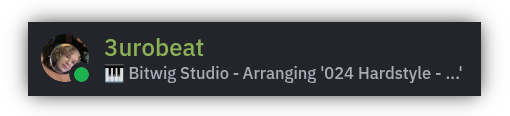

<div align="center">
    <h1>fluxer-bitwig</h1>
    <p align="center"></p>
    <h4>💻 Update your Fluxer status with your Bitwig activity!</h4>
    <div>
        <a href="#features">Features</a> •
        <a href="#installing">Installing</a> •
        <a href="#settings">Extension Settings</a>
    </div>
</div> 

&nbsp;

<a id="features"></a>

## Features
- Automatically syncs your current Bitwig Studio activity to your Fluxer status
- Displays your current project name and whether you are arranging, mixing or editing
- Customizable status format with configurable app name, activity text and behavior, see [Extension Settings](#settings)

> [!NOTE]
> Fluxer does not yet support Rich Presence (RPC), so this extension uses the Custom Status feature to show your activity.  
> This requires the extension to use your user token to authenticate the API requests.  
> As soon as Fluxer adds support for RPC, this extension will be updated to utilize it.

&nbsp;

<a id="installing"></a>

## Installing
### Download
Download the `.bwextension` file from the Assets section of the latest [release](https://github.com/3urobeat/fluxer-bitwig/releases/latest).  
Open Bitwig and simply drag the downloaded file into Bitwig.

If that doesn't work for you, manually copy the file into your Extensions folder, which should be located at:
- Windows: `%USERPROFILE%\Documents\Bitwig Studio\Extensions\`
- Mac: `~/Documents/Bitwig Studio/Extensions/`
- Linux: `~/Bitwig Studio/Extensions/`

&nbsp;

<details>
<summary><strong>Building from source & installing for development instead</strong> (Click to unfold)</summary>

Make sure you have `openjdk-17` and `maven` installed and that your shell environment points to the Java 17 installation (you'll otherwise get `error: invalid target release: 17`).  
Clone this repository and `cd` into it.
```bash
# To compile, run:
mvn install
# Alternatively you can run 'mvn clean' to clean or 'mvn clean install' to do a clean build.
# Tip: To only resolve dependencies but not build, run 'mvn dependency:resolve'.

# Link the compiled extension once. In the future you only need to restart Bitwig to reload the extension
ln -s ./target/fluxerbitwig.bwextension ~/Bitwig\ Studio/Extensions
```
In Bitwig, open Settings > Shortcuts, search for 'console' and bind the plugin console to a key, for example <kbd>CTRL</kbd>+<kbd>Shift</kbd>+<kbd>J</kbd>.  
Press that key combination and select 'fluxer-bitwig' in the popup window to see all messages the plugin logs through the API to the host.

</details>

&nbsp;

In Bitwig, open Settings > Controllers and press '+ Add Controller'.  
From the 'Hardware Vendor' dropdown select '3urobeat' and then 'Fluxer Bitwig'.  
Press Add. A new controller (🎹 keyboard) icon will appear in the top right corner of Bitwig. 

&nbsp;

### Configuration
The extension uses an external configuration file, so that your settings apply to all your Bitwig projects and are not saved within them.  
One exception is the "Enable" setting, which can be configured on a per-project basis.

In Bitwig, open Fluxer Bitwig's controller popout (🎹 in the top right) and press the 'Open Configuration File' button.  
Your default text editor should open. (Not working? Find and open the file manually, see [Settings](#extension-settings) below!)

You need to provide your Fluxer user token so the extension can make the API requests to update your account's status.  
All other settings can be left at default.  
To retrieve your user token:
1. Log in to Fluxer at [https://web.fluxer.app](https://web.fluxer.app) or your desktop app
2. Open your Developer Tools by pressing <kbd>F12</kbd> (browser) or <kbd>Ctrl</kbd>+<kbd>Shift</kbd>+<kbd>I</kbd> (desktop app)
3. Go to the `Application` Tab at the top
4. Under `Storage` on the left, unfold `Local storage` and `https://web.fluxer.app`
5. Find the entry `token` in the table on the right and copy its value `flx_abcdefg...`
6. Inside the opened config file, paste it after `token=` and save the file.

The extension will automatically reload. Open a project and take a look at your Fluxer status!

&nbsp;

> [!WARNING]
> User tokens are sensitive information and provide access to your account. They must not be shared with anyone.  
> Should your token ever get leaked, update your Fluxer password to invalidate old tokens/sessions.

&nbsp;

<a id="settings"></a>

## Extension Settings
### Project-Specific
Controller/Extension Settings can be accessed from the controller popout in the top right of Bitwig (🎹 keyboard icon).  
The following settings are saved inside the project file:

| Setting | Default | Description |
|---------|---------|-------------|
| `Enable` | On | Controls whether extension is enabled for this project |

&nbsp;

### Cross-Project
Cross-Project Extension Settings are saved in a project file on your system. The following paths are used:
- Linux: ~/.config/fluxer-bitwig/config.properties
- macOS: ~/Library/Application Support/fluxer-bitwig/config.properties
- Windows: %APPDATA%\fluxer-bitwig\config.properties

You can open the configuration file from within the Fluxer Bitwig Controller popout in Bitwig (🎹 in the top right).

| Setting | Default | Description |
|---------|---------|-------------|
| `Fluxer Token` |  | User Token to authenticate with Fluxer. This is sensitive and should not be shared |
| `Status Format` | "🎹 {appName} {activityText}" | Controls formatting of status text. Variables: {appName}, {activityText} |
| `Status Activity Text` | "- {activity}" | Controls formatting of activity text to show in status text. Variable {activity} will be replaced by your current project name |
| `Status App Name` | "Bitwig Studio" | Application name to show in status text |
| `Show Idle` | On | If disabled, extension will clear {activityText} instead of showing 'Idling' when no project is loaded |
| `Clear Idle After` | 0 | Time in ms of being idle after which your status should be cleared. Set to 0 to never clear |
